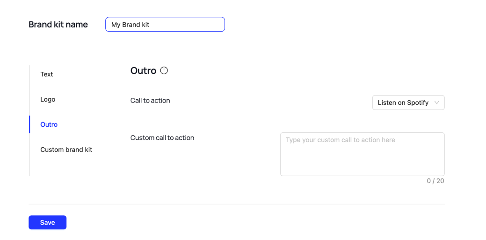

To run the project:

```bash
yarn
yarn dev
# or
npm i
npm run dev
```

To run the project in Docker:

```bash
docker build -t outro .  
docker run -it --name outro-container -p 3000:3000 outro
```

To retrieve output-video from docker container run

```bash
docker cp outro-container:/app/output-outro.mp4 ./
```

To open the application navigate to http://localhost:3000 in your browser

After generation output-outro.mp4 it should be located at the root of the project

